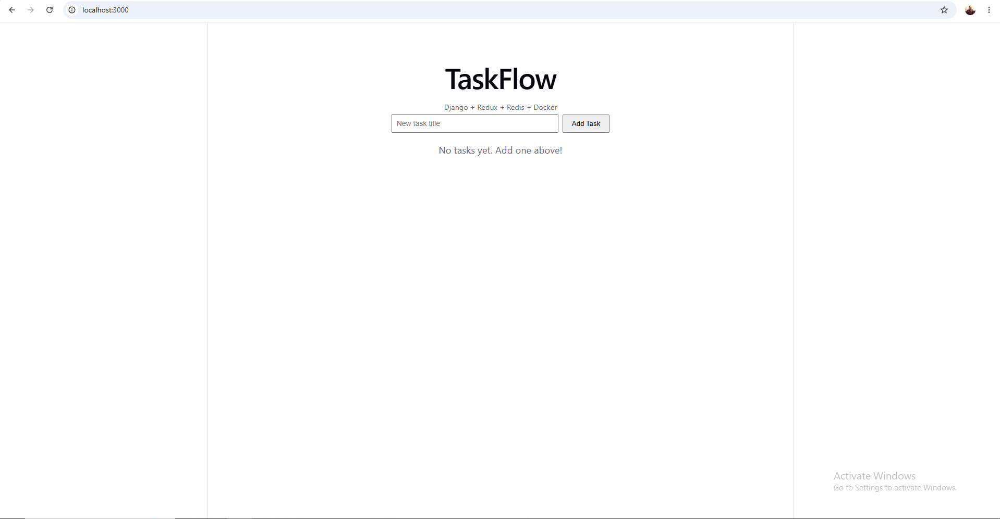

## Testing

# TaskFlow

[](https://github.com/Ranjitdas1032/Docker_Fullstack/actions/workflows/ci.yml)

A full-stack task management app...

### Run E2E tests locally

Make sure the app is running first:
\```bash
docker compose up -d
\```

Then run Cypress:
\```bash
cd frontend
npm install                # if you haven't yet
npm run cypress:open       # interactive UI mode (recommended)
# OR
npm run cypress:run        # headless mode (faster, no UI)
\```

### Tests covered
- App loads and shows correct header
- Empty state displays when no tasks exist
- Can create a new task
- Task status cycles from pending to completed
- Can delete a task

Tests automatically clean up the database between runs via API calls.

### Screenshot of project
